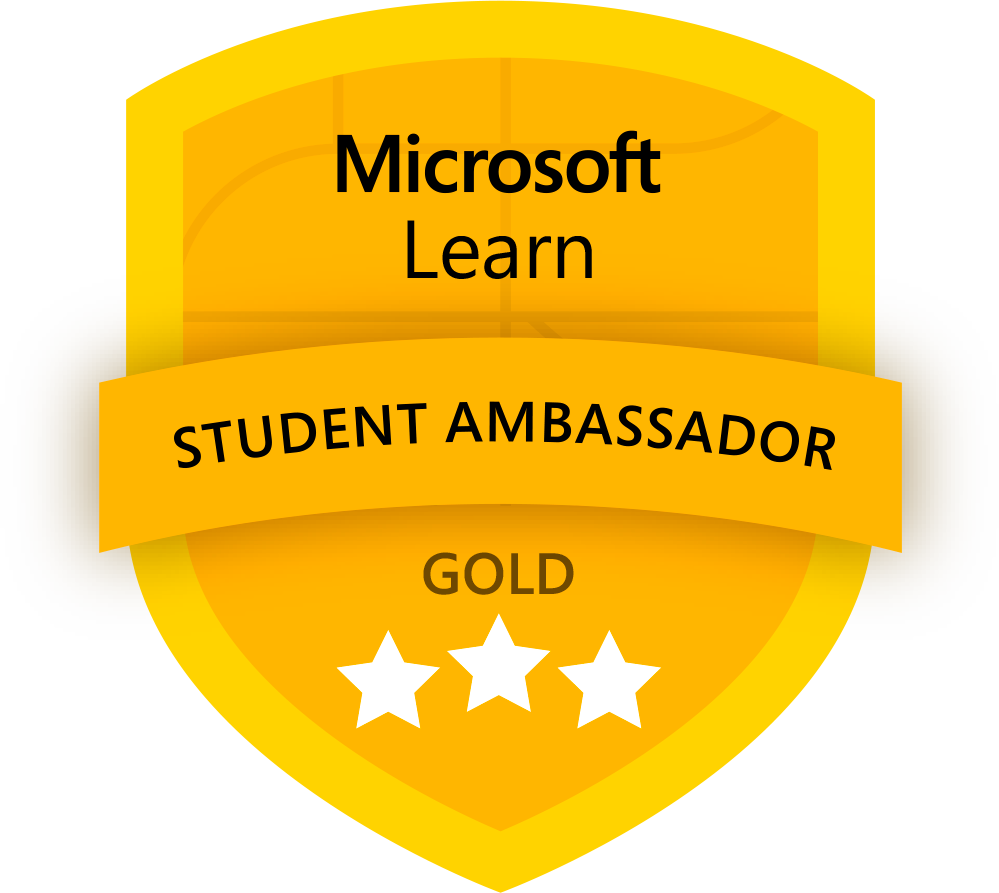
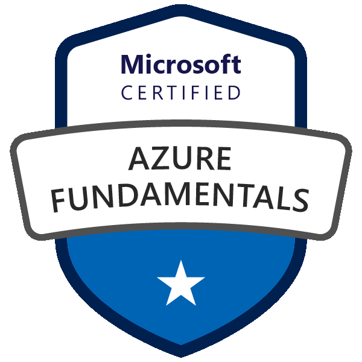
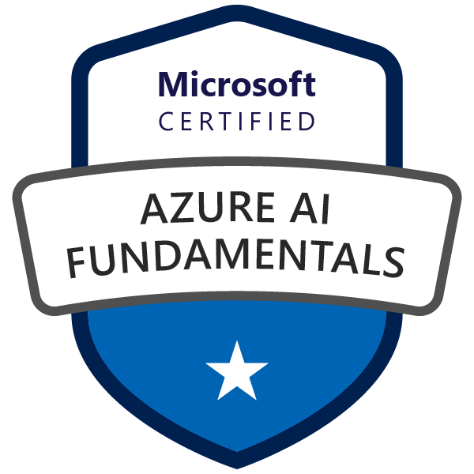
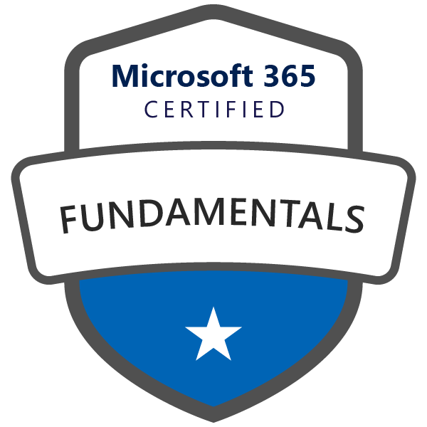
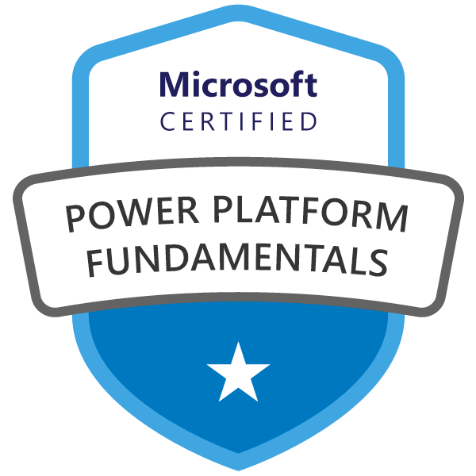
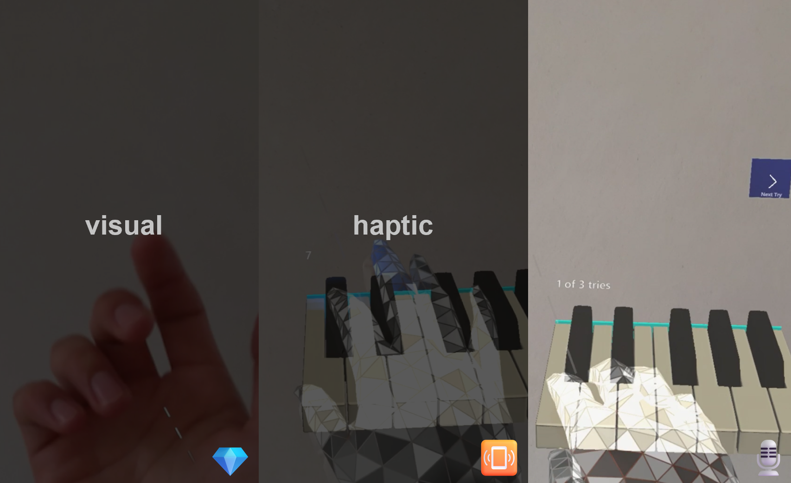
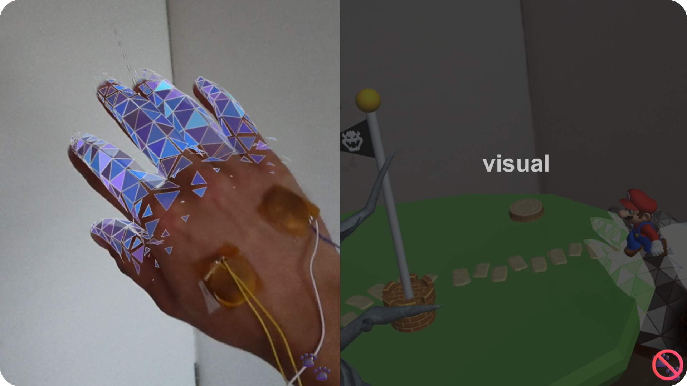
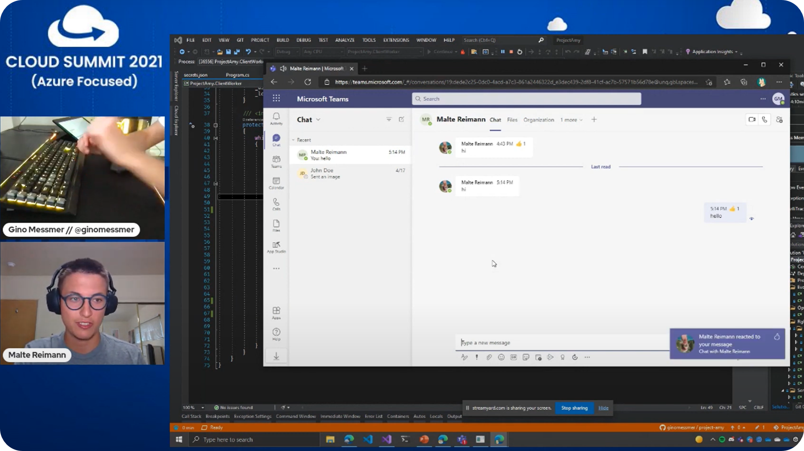
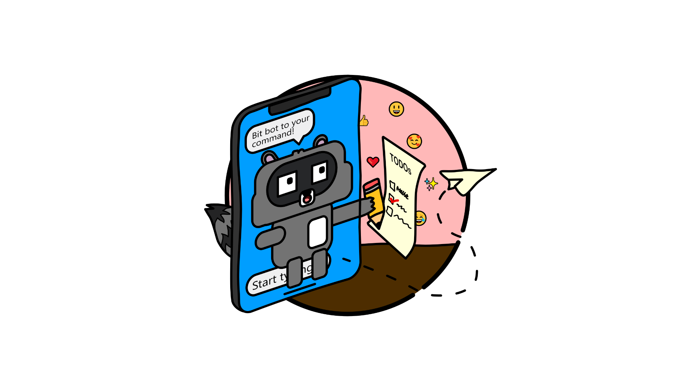
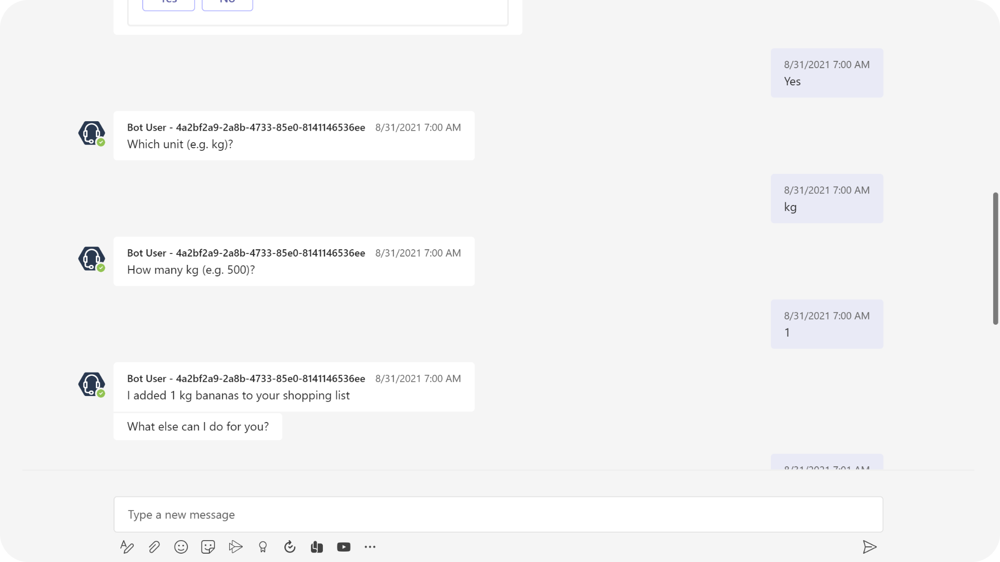

### 👋 Hi there!
I am Malte Reimann, a fresh bachelor of computer science graduate at Karlsruhe Institute of technology. Along with university my activities are: community building as a <a href="https://studentambassadors.microsoft.com/en-US/profile/56292">Gold Microsoft Learn Student Ambassador</a>, ... , and so much more. Let's explore some facets of my life.

---

### Snackable Bites
👦🏽 Pronouns: he/him/his

💬 Languages: Deutsch, English (TOEFL score of 112) and un peu de français.

👨🏽‍💻 ~~Favorite~~ /*\*surprise, I don't have one favorite\**/ **Programming Language** /*\*instead of singeling out one, here are the ones I program in\**/:

 * Java /*\*first programming language I learned.\**/
 * TypeScript /*\*love it because it is JavaScript with all its freedom but I couldn't go without the static typing.\**/
 * C/C++ /*\*C and C++ helped me to learn a lot about hardware.\**/
 * Python /*\*I appreciate all the libraries for machine learning and visualizing data in Python. However, don't like the Python compiler not complaining enough.\**/
 * C# /*\*Best language for business applications and using cloud services.\**/
 * Haskell /*\*I love how elegant functional programming is and am glad that I learned it at university. I wish it would be used in more projects.\**/
 * SQL /*\*The organization part of my brain loves SQL for its ability to structure data.\**/

**Working Experience**: SkipQ, a startup to give customers time back in their daily purchases; research assistant and teaching assistant at Karlsruhe Institute of Technology.

---

### Past Projects

 

<b>Bachelor's Thesis: Application of On-Skin Actuators for Haptic Feedback in Mixed Reality</b>

  <b>Technologies</b>: Unity, Mixed Reality Toolkit, HoloLens 2, C#, C, PCB design, 3D printing, ESP32 microcontroller, Python for data analysis
   
  <b>Further Links</b>:  <a href="https://github.com/MalteRei/KIT-bachelor-thesis-piano">Piano Application Repo</a>,  <a href="https://github.com/MalteRei/KIT-bachelor-thesis-game">Game Repo</a>
  
  
For my bachelor's thesis I developed and evaluated two mixed reality applications. The first application is a virtual piano learning environment in which learning through a visual tutorial or a haptic tutorial that vibrates the finger to press the next piano key with. In the second application the player has to help a character across holographic floating islands. The canyon between the islands are to wide for the character to jump by itself. Through hand tracking the player can bridge the gap with their hand. One variation of the game allows the player to feel the steps of the character walking across the players hand. Both applications run on a HoloLens 2, borrowed from <a href="https://www.media-lesson.com/en/index.html">medialesson</a>. The hardware for the on-skin actuators for haptic feedback is based on state of the art research. They work through Lorenz force between a magnet and a circuit. The learning rate in the piano application was evaluated with a between-subject study. A diverse within-subject study gives insight into the feeling of presence of playing the game with haptic feedback.

 
 

 

<b>Project Amy: Microsoft Graph, Emojis, Serverless Computing and loads of RGB</b>

  <b>Technologies</b>: Azure Functions, TypeScript, C#, Microsoft Graph, Azure Storage Queue, GitHub Actions
   
  <b>Further Links</b>:  <a href="https://github.com/ginomessmer/project-amy">Repo</a>,  <a href="https://youtu.be/INll8mavIas">Recording</a>,  <a href="https://www.linkedin.com/posts/ginomessmer_microsoftteams-azure-cloudsummit2021-activity-6845632519157755905-l69r">Post</a>,  <a href="https://azuresummit.live/amy-reacted-to-your-message-600-pm-teams-app-iot-device-and-lots-of-emojis-by-gino-and-malte/">Cloud Summit Event</a>
  
  
In collaboration with <a href="https://github.com/ginomessmer">Gino Messmer"</a> we build a serverless application that uses the Microsoft Teams endpoint to notify our application when someone reacts to a message in our chat. When someone reacts to our message, for example with a thumbs up, the RGB keyboard on our workdesk lights up in the color of the emoji, in the example yellow. Why? RGB makes everything faster, even working. Kidding aside, it is a neat project to get started with the Microsoft Graph endpoint for Teams and to teach about serverless computing. We presented the project at the global 2021 Cloud Summit. Go have a look, you can find the recording in the links above.

 
 

  

<b>Shopping List Bot: Building a Shopping List with a Sprinkle of Intelligence</b>

<b>Technologies</b>: Azure Functions, TypeScript, Microsoft Bot Framework, Cosmos DB, Language Understanding, Microsoft Teams, Adaptive Cards, GitHub Actions
 
<b>Further Links</b>:  <a href="https://github.com/microsoft-campus-community/workshop-shopping-list-bot">Repo</a>,  <a href="https://youtu.be/GD9AePydcs4">Microsoft 365 Developer Interview</a>,  <a href="https://youtu.be/32QL7wITclw">Recording full-length workshop</a>
 

<a href="https://github.com/spethso">Sandro Speth</a> and I created a prepackaged workshop for other Microsoft Learn Student Ambassadors to host. The workshop teaches how to build a smart chatbot using the Microsoft Bot Framework and LUIS service. The bot can manage a shared shopping list for a group chat, for example with roommates. To store the shopping list we also build a serverless backend that stores list items in a Cosmos DB using the MongoDB API. To showcase the project we were interviewed on the Microsoft 365 Developer YouTube channel. The GitHub repoistory contains a detailed wiki you should have a look at to get started with any of the technologies or to do the workshop.

 
 

  

<b>Shopping List Bot: Building a Shopping List with a Sprinkle of Intelligence</b>

<b>Technologies</b>: Azure Functions, TypeScript, Microsoft Bot Framework, Cosmos DB, Language Understanding, Microsoft Teams, Adaptive Cards, GitHub Actions
 
<b>Further Links</b>:  <a href="https://github.com/microsoft-campus-community/workshop-shopping-list-bot">Repo</a>,  <a href="https://youtu.be/GD9AePydcs4">Microsoft 365 Developer Interview</a>,  <a href="https://youtu.be/32QL7wITclw">Recording full-length workshop</a>
 

<a href="https://github.com/spethso">Sandro Speth</a> and I created a prepackaged workshop for other Microsoft Learn Student Ambassadors to host. The workshop teaches how to build a smart chatbot using the Microsoft Bot Framework and LUIS service. The bot can manage a shared shopping list for a group chat, for example with roommates. To store the shopping list we also build a serverless backend that stores list items in a Cosmos DB using the MongoDB API. To showcase the project we were interviewed on the Microsoft 365 Developer YouTube channel. The GitHub repoistory contains a detailed wiki you should have a look at to get started with any of the technologies or to do the workshop.

**MalteRei/MalteRei** is a ✨ _special_ ✨ repository because its `README.md` (this file) appears on your GitHub profile.

Here are some ideas to get you started:

- 🔭 I’m currently working on ...
- 🌱 I’m currently learning ...
- 👯 I’m looking to collaborate on ...
- 🤔 I’m looking for help with ...
- 💬 Ask me about ...
- 📫 How to reach me: ...
- 😄 Pronouns: ...
- ⚡ Fun fact: ...
-->

