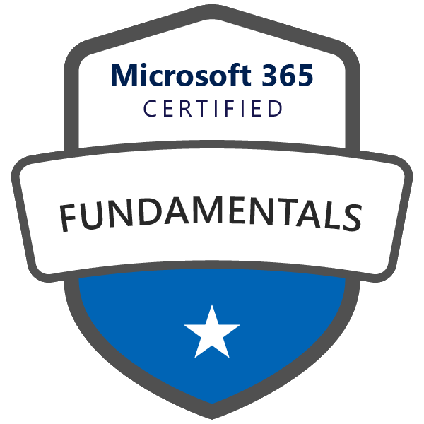
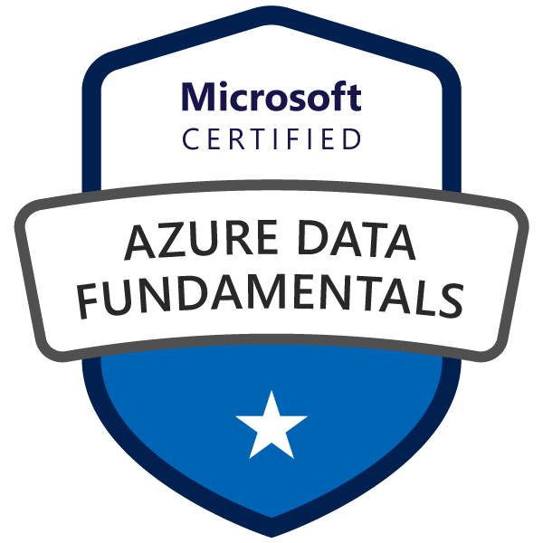

### 👋 Hi there!
I am Malte Reimann, a fresh bachelor of computer science graduate at Karlsruhe Institute of technology. Along with university my activities are: community building as a <a href="https://studentambassadors.microsoft.com/en-US/profile/56292">Gold Microsoft Learn Student Ambassador</a>, ... , and so much more. Let's explore some facets of my life.

---

#### 🍪 Snackable Bites
👦🏽 Pronouns: he/him/his
💬 Languages: Deutsch, English (TOEFL score of 112) and un peu de français
👨🏽‍💻 ~~Favorite~~ /*that's not sackable*/ Programming Language /*instead of singeling out one here are the ones I program in)*/:
    * Java /*first programming language I learned.*/
    * TypeScript /*love it because it is JavaScript with all its freedom but I couldn't go without the static typing.*/
    * C/C++ /*C and C++ helped me to learn a lot about hardware.*/
    * Python /*I appreciate all the libraries for machine learning and visualizing data in Python. However, don't like the Python compiler not complaining enough.*/
    * C# /*Best language for business applications and using cloud services.*/
    * Haskell /*I love how elegant functional programming is and am glad that I learned it at university. I wish it would be used in more projects.*/
    * SQL /*The organization part of my brain loves SQL for its ability to structure data.*/

Working Experience SkipQ, a startup to give customers time back in their daily purchases; research assistand and teaching assistant at Karlsruhe Institute of Technology

**MalteRei/MalteRei** is a ✨ _special_ ✨ repository because its `README.md` (this file) appears on your GitHub profile.

Here are some ideas to get you started:

- 🔭 I’m currently working on ...
- 🌱 I’m currently learning ...
- 👯 I’m looking to collaborate on ...
- 🤔 I’m looking for help with ...
- 💬 Ask me about ...
- 📫 How to reach me: ...
- 😄 Pronouns: ...
- ⚡ Fun fact: ...
-->

