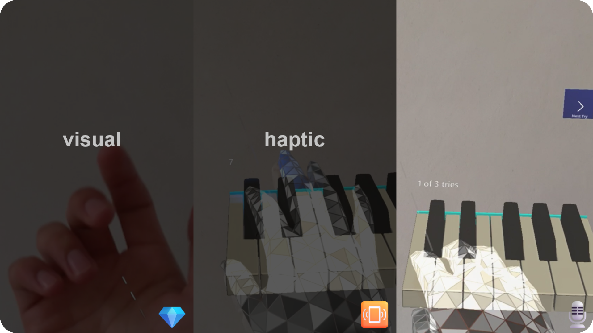

### 👋 Hi there!
I am Malte Reimann, a fresh bachelor of computer science graduate at Karlsruhe Institute of technology. Along with university my activities are: community building as a <a href="https://studentambassadors.microsoft.com/en-US/profile/56292">Gold Microsoft Learn Student Ambassador</a>, ... , and so much more. Let's explore some facets of my life.

---

### Snackable Bites
👦🏽 Pronouns: he/him/his

💬 Languages: Deutsch, English (TOEFL score of 112) and un peu de français.

👨🏽‍💻 ~~Favorite~~ /*\*surprise, I don't have one favorite\**/ **Programming Language** /*\*instead of singeling out one, here are the ones I program in\**/:

 * Java /*\*first programming language I learned.\**/
 * TypeScript /*\*love it because it is JavaScript with all its freedom but I couldn't go without the static typing.\**/
 * C/C++ /*\*C and C++ helped me to learn a lot about hardware.\**/
 * Python /*\*I appreciate all the libraries for machine learning and visualizing data in Python. However, don't like the Python compiler not complaining enough.\**/
 * C# /*\*Best language for business applications and using cloud services.\**/
 * Haskell /*\*I love how elegant functional programming is and am glad that I learned it at university. I wish it would be used in more projects.\**/
 * SQL /*\*The organization part of my brain loves SQL for its ability to structure data.\**/

**Working Experience**: SkipQ, a startup to give customers time back in their daily purchases; research assistant and teaching assistant at Karlsruhe Institute of Technology.

---

### Past Projects

<b>Bachelor's Thesis: Application of On-Skin Actuators for Haptic Feedback in Mixed Reality</b>

 

 
  <h4>Application of On-Skin Actuators for Haptic Feedback in Mixed Reality</h4>
  <b>Technologies</b>: Unity, Mixed Reality Toolkit, HoloLens 2, C#, C, PCB design, 3D printing, ESP32 microcontroller, Python for data analysis
   
  <b>Further Links</b>:<a href="https://github.com/MalteRei/KIT-bachelor-thesis-piano">Piano Application Repo</a><a href="https://github.com/MalteRei/KIT-bachelor-thesis-piano">Game Repo</a>
   
  
For my bachelor's thesis I developed and evaluated two mixed reality applications. The first application is a virtual piano learning environment in which learning through a visual tutorial or a haptic tutorial that vibrates the finger to press the next piano key with. In the second application the player has to help a character across holographic floating islands. The canyon between the islands are to wide for the character to jump by itself. Through hand tracking the player can bridge the gap with their hand. One variation of the game allows the player to feel the steps of the character walking across the players hand. Both applications run on a HoloLens 2, borrowed from <a href="https://www.media-lesson.com/">mediaLesson</a>. The hardware for the on-skin actuators for haptic feedback is based on state of the art research. They work through Lorenz force between a magnet and a circuit. The learning rate in the piano application was evaluated with a between-subject study. A diverse within-subject study gives insight into the feeling of presence of playing the game with haptic feedback.

  

<!-- end work project section -->

**MalteRei/MalteRei** is a ✨ _special_ ✨ repository because its `README.md` (this file) appears on your GitHub profile.

Here are some ideas to get you started:

- 🔭 I’m currently working on ...
- 🌱 I’m currently learning ...
- 👯 I’m looking to collaborate on ...
- 🤔 I’m looking for help with ...
- 💬 Ask me about ...
- 📫 How to reach me: ...
- 😄 Pronouns: ...
- ⚡ Fun fact: ...
-->

